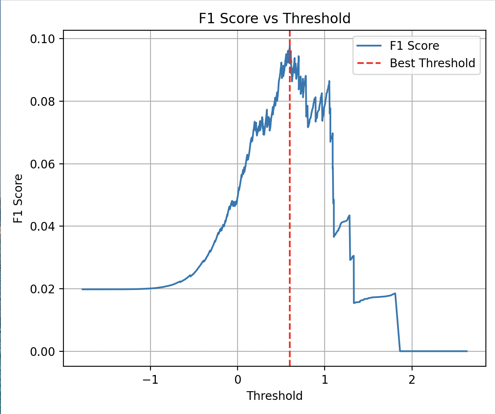
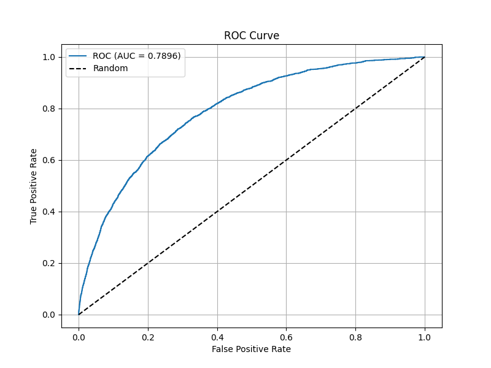
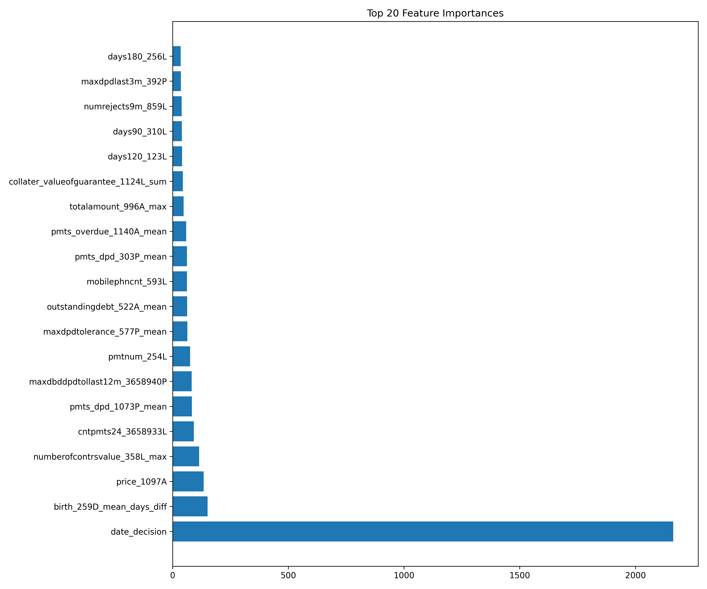
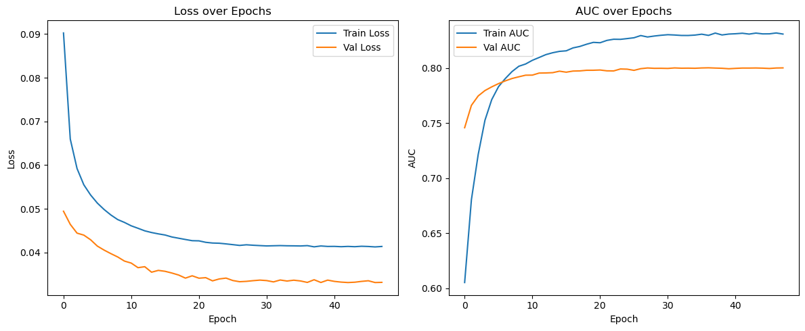
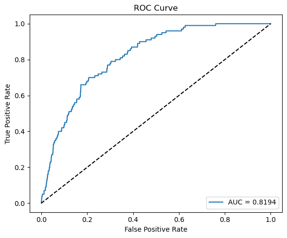

# credit-risk-prediction
### Group Name: Cheesecake   
### Group Member: Yuan Gao, Rongzheng Ma, Tianyi Ma, Huiwen Lian, and Yishan Yuan   

# Background of the project

In the consumer finance industry, lenders must decide whether to approve a loan based on limited information provided at the time of application. Traditionally, this decision heavily relies on the applicant’s credit history, which may be unavailable or insufficient for many individuals, such as young people or those who rely on cash. With the growth of alternative data sources, such as behavioral attributes and application-level features, it becomes possible to assess credit risk more broadly. This project addresses the challenge of building a predictive model that can estimate the likelihood of default using only the information available before the loan is issued.

# Goal of the project

The objective of this project is to build a machine learning model that predicts the probability of loan default at the point of application. The model leverages various applicant features—demographics, payment behavior summaries, application-level data, and external credit data—available before any loan is issued. We focus purely on static, pre-loan features to support real-time credit decision-making. By accurately identifying high-risk applicants early, lenders can reduce default rates and improve financial inclusion for underbanked populations.

# Source of dataset

The dataset is provided by Home Credit through a Kaggle competition (https://www.kaggle.com/competitions/home-credit-credit-risk-model-stability/overview). It includes anonymized, structured information collected during loan applications. The data is divided into several depth levels, each corresponding to features aggregated at different granularities. It comprises internal customer attributes, external credit bureau records, and basic demographic information. Most variables are available at the time of the loan application.

# Limitation of data

* While some descriptions provide basic context, they still lack detailed definitions or calculation formulas. This can make it difficult to determine whether variables are redundant, correlated, or overlapping.
* Missing values are prevalent, and the dataset doesn’t specify whether missingness is structural or random. Misinterpreting missingness may bias the model.
* The dataset lacks clear timestamp alignment, even though variables reference historical behavior. This may limit precise sequencing or trend analysis, even within the static pre-loan snapshot.

# Work Flow

Data merge -> Feature Engineering -> 5 types of Models -> Evaluation

## Feature Engineering

### Data structure and merge
depth=0 - These are static features directly tied to a specific case_id   
depth=1 - Each has an associated historical record, indexed by case_id num_group1   
depth=2 - Each has an associated historical record, indexed by both case_id num_group1 num_group2  
For example, a person may have multiple past loans, and each of these loan records corresponds to Depth 1 data. Then, for each loan, there are detailed transactional records such as individual repayment events, which can be considered Depth 2 data.

Totally 465 features in these data, for depth 2 data, we first merged the static data, including application form features and credit bureau summary tables. Then, for Depth 1 and Depth 2 datasets, we applied customised aggregation rules based on feature suffixes. The specific operations are as follows:

| Feature Suffix | Assumed Type            | Aggregation Strategy                        |
|:--------------:|:-----------------------:|:-------------------------------------------:|
| `P`, `A`       | Numeric (payments, amounts) | mean, max, min, std                     |
| `D`            | Date                     | diff            |
| `M`            | Categorical or ID-like   | first, last, nunique                       |
| `L`, `T`       | Count or frequency       | sum, max, min                              |
| `num_group`    | Group identifier         | max, nunique                               |
| *Other*        | Undefined or skipped     | No aggregation or default handling applied |

Finally, we obtained aggregated feature tables for Depth 1 and Depth 2, then merged them into the final dataset based on case_id.

### Feature construction
* Formula-based Features: Ratio metrics reflecting financial burden like: debt_pressure_index = (currentdebt + debtoverdue) / income.
* Date-difference Features: Time gaps (in days) between a reference date and key events.
* RFM-style Features: Behavioral metrics to capture recency(how long ago the customer last took key credit-related actions), frequency(how often a customer engages in financial actions), and monetary(the financial weight and risk by evaluating debt ratios, loan size relative to income, and repayment behavior).

### Feature selection
* Null Importance Filtering: Compared real LightGBM feature importance with null (shuffled target) importance to retain features significantly more informative than noise.
* Adversarial Validation: Tested if features can distinguish between time-based data splits. Features that generalized well across time were retained.
* Selected the top 60 most important features based on LightGBM's final training importance scores.

## Lasso + SVC
### What is Lasso + SVC?
This model pipeline combines Lasso regression for feature selection with Linear Support Vector Classification (LinearSVC) for prediction. It is designed to handle high-dimensional, imbalanced classification problems efficiently.
Lasso acts as a filter to automatically drop irrelevant features by penalizing their coefficients, shrinking many of them to zero. The reduced feature set is then used by LinearSVC, which is optimized for speed and scalability on large datasets. By combining the two, we achieve both interpretability and efficient computation — critical for real-world applications like credit risk scoring.

### Core Components
Feature Selection with Lasso: Lasso (L1 regularization) shrinks less important feature coefficients to zero, effectively selecting a sparse subset of predictors. 

Classifier: LinearSVC: A fast linear support vector machine optimized for large-scale classification, well-suited for imbalanced data when paired with class weights. 

Undersampling: Reduces the majority class to balance the training distribution. 

Standardization: All features are scaled to zero mean and unit variance to stabilize SVM optimization. 

Evaluation: Model performance is assessed using ROC AUC, Precision-Recall AUC, F1 score, and a confusion matrix. 

### Model Summary
**Lasso Selected Features**: 41  
**Classifier**: LinearSVC(class_weight='balanced', max_iter=1000)  
**LinearSVC ROC AUC**: 0.7810  
**Best F1 Threshold**: 0.5989  
**Accuracy**:  0.7539  
**Precision**: 0.0257  
**Recall**:    0.6400 
**F1 Score**:  0.0494

### Feature Selection: Lasso

We used Lasso to select the most informative features. It selected 41 features. Below is the bar chart of selected feature coefficients:

### Evaluation: Confusion Matrix

The confusion matrix shows that while false positives are high, the model successfully identifies most default cases (recall ≈ 64%).

### Evaluation: ROC Curve

The ROC AUC on the test set is **0.7981**, showing solid separability between default and non-default cases.

### Evaluation: Precision-Recall Curve

The Precision-Recall (PR) curve shows a steep drop-off in precision even at low recall values. The PR AUC is **0.0403**, indicating poor performance in identifying true positive events under class imbalance. This suggests the model may need further calibration or alternative resampling methods (e.g., SMOTE, ensemble techniques) to improve its effectiveness in real-world imbalanced data scenarios.

### Threshold Tuning

This chart helps identify the optimal decision threshold that balances precision and recall by maximizing the F1 score.  
The F1 score peaks at a threshold of **0.0494**.
While threshold tuning slightly improves performance, the overall F1 score remains low, suggesting challenges in precision-recall tradeoff under class imbalance.

### Prediction Distribution

Histogram of decision scores for the positive class shows most scores clustered near zero. This indicates the classifier is often uncertain when predicting rare default events, reinforcing the importance of careful threshold calibration.

### Conclusion
This modeling pipeline combines Lasso regression for feature selection with a Linear Support Vector Classifier (LinearSVC) to predict credit default events in a highly imbalanced dataset. Lasso selected 41 informative features out of 63, helping reduce noise and improve model generalization. ROC curves show that the model has good discrimination capability (AUC = 0.7810), but the precision-recall curve (PR AUC = 0.0403) reveals difficulty in precisely identifying true positive cases due to class imbalance. Threshold tuning improves recall significantly (up to 64%), but this comes at the cost of very low precision, highlighting a high false positive rate. Lasso feature coefficients help interpret key risk factors, and the distribution of decision scores shows many predictions close to the decision boundary, underlining the importance of threshold calibration. Overall, the model is effective at detecting rare default events with high recall—valuable in risk-sensitive scenarios—but further techniques such as cost-sensitive learning, re-sampling, or ensemble methods are needed to improve precision and reduce false alarms.

## CatBoost Model 

###  Introduction

In the realm of credit risk modeling, handling categorical variables and ensuring model stability over time are paramount. CatBoost, developed by Yandex, is a gradient boosting algorithm that excels in these aspects. Its native support for categorical features and robust performance on imbalanced datasets make it an ideal choice for predicting credit risk.

### Why Choose CatBoost Over XGBoost?

While XGBoost is a popular choice for gradient boosting, CatBoost offers several advantages:

* **Native Categorical Feature Handling**: CatBoost automatically processes categorical variables without the need for manual encoding, preserving the natural order and relationships within the data.

* **Ordered Boosting**: This technique reduces overfitting by using permutations of the dataset to calculate leaf values, leading to more robust models.

* **Efficient Training**: CatBoost often requires less parameter tuning and can achieve high performance with default settings, streamlining the modeling process.

* **Stability Over Time**: CatBoost's approach to handling categorical variables and missing values contributes to consistent performance across different time periods, aligning with the competition's focus on model stability.

### Model Implementation

The CatBoost model was implemented with the following considerations:

* **Data Preprocessing**:

  * Missing numerical values were imputed using the median.
  * Missing categorical values were imputed using the mode.
  * Categorical features were identified and specified for CatBoost's native handling.

* **Model Parameters**:

  * `iterations`: 1000
  * `learning_rate`: 0.05
  * `depth`: 6
  * `loss_function`: 'Logloss'
  * `eval_metric`: 'AUC'
  * `random_seed`: 42
  * `od_type`: 'Iter'
  * `od_wait`: 100
  * `class_weights`: Computed based on class distribution to address imbalance.

* **Training Strategy**:

  * The dataset was split into training and validation sets with an 80/20 ratio, maintaining class distribution.
  * Early stopping was employed to prevent overfitting.
  * The optimal classification threshold was determined by maximizing the F1 score on the validation set.

### Visualizations

Visual representations were generated to evaluate model performance and feature importance:

#### 1. ROC Curve

  

*The ROC curve illustrates the trade-off between true positive rate and false positive rate. The area under the curve (AUC) provides a measure of the model's ability to distinguish between classes.*

#### 2. Precision-Recall Curve

  

*This curve highlights the balance between precision and recall for different threshold settings, aiding in selecting the optimal threshold for classification.*

#### 3. Feature Importance

*The top 20 features contributing to the model's predictions are displayed, offering insights into the most influential variables.*

  

### Conclusion

The CatBoost model demonstrated solid performance in predicting credit default risk with a strong balance between discriminatory power and thresholded classification metrics. Key results on the validation set include:

* **Validation AUC**: 0.8212
* **Gini Coefficient**: 0.6424
* **Optimal Threshold**: 0.7732
* **Validation Precision**: 0.1828
* **Validation Recall**: 0.3159
* **Validation F1 Score**: 0.2316

This indicates:

* The model ranks defaulters and non-defaulters effectively (high AUC and Gini).
* With the optimal threshold of **0.7732**, the model makes **conservative but meaningful default predictions**—prioritizing **precision** to avoid false positives while still capturing a reasonable number of actual defaults.
* These trade-offs are critical in financial settings, where the cost of false positives (rejecting good clients) and false negatives (approving risky loans) must be carefully balanced.

CatBoost’s ability to natively handle categorical variables, deal with imbalanced data through class weighting, and deliver strong performance with minimal tuning makes it a highly effective choice for this competition’s goals.

---

## LightGBM Model for Credit Risk Prediction

### Introduction

This module uses **LightGBM (LGBMClassifier)** to build a high-performance, tree-based model which handles large-scale tabular data efficiently and produces strong predictive performance, especially in the presence of class imbalance and mixed feature types.

### Why Use LightGBM?

Compared to traditional GBDT implementations, LightGBM offers the following advantages:

* **Faster training speed and lower memory usage**
* **Built-in support for categorical features** (when properly encoded)
* **Support for large datasets**
* **Histogram-based decision tree learning** for better speed/accuracy tradeoff

LightGBM is particularly well-suited to this task due to its ability to scale with large, sparse, and imbalanced datasets, which are typical in credit risk applications.

### Model Implementation

#### Configuration

* **Learning Rate**: 0.03
* **Estimators**: 4000 (with early stopping)
* **Max Depth**: 6
* **Regularization**: `reg_alpha=0.1`, `reg_lambda=1.0`
* **Loss**: Binary Log Loss
* **Class Weights**: Automatically computed from training set imbalance

#### Validation Strategy

* Train/Validation split: 80/20 (stratified)
* Threshold tuning: Optimal threshold based on **F1 score** via Precision-Recall curve
* Final prediction threshold: **0.7344**

### Visualizations

All visual outputs are saved in the `visualizations/` folder and shown below.

#### 1. ROC Curve

  

The ROC curve reflects the model’s discriminative power.
**AUC = 0.7855** shows the model can reasonably distinguish between defaulters and non-defaulters.

#### 2. Precision-Recall Curve

  

This curve is critical for evaluating performance under class imbalance.
We use it to select the threshold that maximizes the **F1 score**.

#### 3. Feature Importance

  

The top 20 features used by LightGBM highlight both behavioral and demographic signals, such as:

* `numberofcontrsvalue_358L_max`
* `birth_259D_mean_days_diff`
* `price_1097A`

These contribute strongly to predicting credit default risk.

###  Conclusion

The LightGBM model provides reliable performance with high training efficiency. Final validation metrics:

* **Validation AUC**: 0.7855
* **Gini Coefficient**: 0.5710
* **Optimal Threshold**: 0.7344
* **Validation Precision**: 0.1742
* **Validation Recall**: 0.3124
* **Validation F1 Score**: 0.2232

This balance of **moderate recall** and **cautious precision** is well-suited to the business trade-offs in credit scoring—where predicting too many false positives can result in unnecessary risk exposure.

LightGBM’s scalability and speed also make it an excellent choice for deploying models in production environments with real-time constraints.

Using the python3 neural_network.py and neural_network_training.py on the cmd to run the data.

## What Is a Neural Network?

A neural network is a type of machine learning model loosely inspired by the human brain. Just as the brain uses networks of neurons to process signals, artificial neural networks use layers of interconnected units to process data and make decisions.

These networks are built from layers of "neurons" that receive inputs, apply transformations, and pass outputs forward. Each layer refines the information, similar to how sensory signals in the brain are interpreted step by step—from raw sensation to recognition and response.

To guide this learning process, neural networks rely on several core components:

* **Activation functions**, which mimic how biological neurons "fire" only under certain conditions.
* **Loss functions**, which act like feedback signals—telling the network how far off its guesses are.
* **Learning rate**, which controls how quickly the network adjusts itself in response to mistakes, much like how the brain gradually strengthens or weakens connections through experience.

Over time, through repeated exposure and adjustment, the network learns to recognize patterns and make predictions.

## Model Choices Overview

This neural network consists of three layers: two hidden layers (64 and 32 units) with `swish` activation and one output layer with a `sigmoid` function for binary prediction.

* **Activation Function**:

  * Hidden layers use **swish**, defined as:

 $$
 f(x) = x \cdot \sigma(x) = \frac{x}{1 + e^{-x}}
 $$

    Swish is smooth and non-monotonic, offering better gradient flow than ReLU in many cases.

* **Loss Function**:
  A custom **Binary Focal Loss** is applied to emphasize learning from hard examples, with $\gamma = 2.5$ and $\alpha = 0.7$.

* **Learning Rate**:
  The model uses the **Adam** optimizer with an initial learning rate of $10^{-4}$, reduced dynamically when validation F1 stagnates.

## Why These Choices

The main reason behind these design choices is that the dataset is **highly imbalanced**—some types of cases appear far more often than others. If we train a model without adjustments, it will mostly learn to predict the majority class and ignore the rare but important ones.

To address this, we made several choices:

* We used **two hidden layers** to give the model enough capacity to learn patterns, without making it too complex and prone to overfitting.
* We chose the **swish activation function** because it works smoothly and helps the model learn better than traditional functions in some cases.
* We applied **focal loss**, a special loss function that tells the model to focus more on the hard and rare cases rather than the easy ones.
* We set a **small learning rate** to help the model learn gradually and avoid jumping to poor solutions.

In addition to the model design, we also:

* **Balanced the data** using a mix of undersampling and oversampling techniques.
* **Standardized all features** to make training more stable.
* **Used F1 score** to measure performance in a way that better reflects how well the model handles both common and rare cases.

All of these steps work together to help the model stay sensitive to the cases that matter most, even if they’re rare.

## Business Motivation: Cost-Aware Classification

In credit scoring, misclassifying users has different consequences:

* **Rejecting a good user** (false positive) means losing expected profit
* **Approving a bad user** (false negative) risks financial loss

To reflect this, we define two economic indices:

* **Expected Loss Index (ELI)** for bad users:

$$
\text{ELI} = \text{EAD} \times \text{LGD} \times \text{PD}
$$

  where EAD is exposure, LGD is potential loss rate, and PD is default probability.

* **Benefit Index (BI)** for good users:

$$
\text{BI} = \text{Loan Amount} \times \text{Interest Rate}
$$

Using these, we select the prediction threshold that minimizes total expected cost:

$$
\text{Cost} = \text{FP} \times \text{Avg(BI)} + \text{FN} \times \text{Avg(ELI)}
$$

This makes the model sensitive to both business risk and potential gain—not just prediction accuracy.

## Results Summary

The model was trained on highly imbalanced data (**Good: 464,748 vs. Bad: 15,450**), using focal loss and resampling techniques to better detect rare default cases.

### 1. Training Performance

Training stopped at **epoch 48** with automatic learning rate reduction. Final metrics:

* **Training AUC**: 0.8295
* **Training F1**: 0.6769
* **Validation AUC**: 0.8003
* **Validation F1**: 0.1389
* **Validation Loss**: 0.0332

  

---

### 2. Economic Evaluation

We used expected loss (ELI) and benefit (BI) to reflect real-world costs:

| User Type     | Avg. Loss Index (ELI) | Avg. Benefit Index (BI) | Count   |
| ------------- | --------------------- | ----------------------- | ------- |
| Good User (0) | 0.0377                | 0.0262                  | 464,748 |
| Bad User (1)  | 0.0546                | 0.0408                  | 15,450  |

* **Optimal threshold** (economic cost minimized): **0.518**
* **Minimum total cost**: **779.51 (normalized units)**

---

### 3. Classification Metrics at Optimal Threshold

* **Accuracy**: 0.7459
* **Precision**: 0.0279
* **Recall**: 0.7200
* **F1 Score**: 0.0536
* **ROC AUC**: 0.8194
* **PR AUC**: 0.0526

  
  

---

### 4. Threshold and Prediction Distribution

* F1 peaks around threshold = 0.60
* Economic cost is lowest at threshold = 0.518
* Prediction probabilities are mostly concentrated between 0.45 and 0.65

  
  

### 5. Final Note

Although the model has limited precision due to class imbalance, the integration of economic cost analysis helps compensate for this by shifting the decision threshold toward minimizing actual financial loss. This allows the model to remain useful in practice, even when statistical metrics alone appear suboptimal.

## DNN + LightGBM + Logistic Stack

### What is DNN + LightGBM + Logistic Stack?

This advanced ensemble model combines Deep Neural Networks (DNN) and LightGBM as base learners with Logistic Regression as a meta-learner through stacking. Unlike simple averaging or voting, stacking trains a meta-model to learn the optimal way to combine predictions from diverse base models.

The pipeline works in two stages: First, DNN and LightGBM independently learn different aspects of the credit risk patterns (neural networks excel at complex non-linear relationships while gradient boosting handles structured data). Second, their predictions become features for a logistic regression meta-model that determines how to best integrate these complementary insights for final classification.

### Core Components

**Base Models:**
- **Deep Neural Network (DNN)**: 3-layer architecture (512-256-1 units) with ReLU activation, designed to capture complex, non-linear patterns in credit profiles
- **LightGBM**: Gradient boosted decision tree framework optimized for speed and handling class imbalance with built-in support for unbalanced datasets

**Meta Model:**
- **Logistic Regression**: Combines base model predictions with class balancing for final decisions

**Key Features:**
- **Random Search Optimization**: **PR AUC as primary metric**, 20 configurations tested for DNN, 15 for LightGBM
- **Dynamic Threshold Optimization**: **F1-score for threshold tuning**
- **Undersampling + Oversampling**: Hybrid approach to address class imbalance
- **Extended Feature Engineering**: 12 derived features per date column

### Model Summary

**DNN Architecture**: [512, 256]  
**DNN Activation**: ReLU  
**DNN Dropout Rate**: 0.4  
**DNN Learning Rate**: 0.0025  
**LightGBM Leaves**: 128  
**LightGBM Tree Depth**: 4  
**LightGBM Learning Rate**: 0.1  
**Meta-Model**: LogisticRegression(class_weight='balanced')  
**Test ROC AUC**: 0.8421  
**Test PR AUC**: 0.0551  
**Test Accuracy**: 0.9295  
**Test Precision**: 0.0532  
**Test Recall**: 0.3600  
**Test F1 Score**: 0.0927

### **Key Performance Characteristics**

The stacked model achieves:
- **Acceptable recall among all models** (0.36 vs LightGBM's 0.23 and DNN's 0.39)
- **Significant false positive reduction** (641 vs DNN's 918)
- **Highest AUC-PR** 
- **Highest F1 Score**

### Evaluation: Confusion Matrix

**Test Set Performance**:

| Model | False Positives | True Positives | False Negatives | True Negatives |
|-------|----------------|----------------|-----------------|----------------|
| LightGBM | 424 | 23 | 77 | 9476 |
| DNN | 918 | 39 | 61 | 8982 |
| Stacked | 641 | 36 | 64 | 9259 |

  

### Evaluation: AUC-ROC Curve

  

  

### Model Comparison

Individual components and stacked ensemble performance comparison:

**Test Set Performance**:

| Model | ROC AUC | PR AUC | Precision | Recall | F1 Score | FNR |
|-------|---------|--------|-----------|--------|----------|-----|
| LightGBM | 0.8403 | 0.0497 | 0.0515 | 0.2300 | 0.0841 | 77% |
| DNN | 0.7861 | 0.0386 | 0.0408 | 0.3900 | 0.0738 | 61% |
| Stacked | **0.8421** | **0.0551** | **0.0532** | 0.3600 | **0.0927** | 64% |

**Training Set Performance**:

| Model | ROC AUC | PR AUC | Precision | Recall | F1 Score | FNR |
|-------|---------|--------|-----------|--------|----------|-----|
| LightGBM | 0.8585 | 0.2088 | 0.2281 | 0.3454 | 0.2747 | 65.5% |
| DNN | 0.7718 | 0.1018 | 0.1095 | 0.3515 | 0.1670 | 64.9% |
| Stacked | 0.8573 | 0.2035 | 0.1919 | 0.4360 | 0.2665 | 56.4% |

Key insights:
- LightGBM achieves highest precision but lowest recall
- DNN captures more defaults with highest recall but many false positives
- Stacked model provides the best balance and highest ROC AUC

### Threshold Optimization

The meta-model enables sophisticated threshold tuning:

* **DNN Optimal Threshold**: 0.2000
* **LightGBM Optimal Threshold**: 0.8000  
* **Meta-Model Threshold**: 0.8000

### Business Impact

**Strategic Balance**:

1. **False Positive Reduction**: From DNN's 918 to Stacked's 641 (30% improvement)
2. **Highest AUC-PR**: Improved by 10.9% (vs LightGBM's 0.0497)
3. **Highest F1**
4. **Highest AUC-ROC Performance**: Best among all models (0.8421)
5. **Practical Trade-off**: Balances precision and recall effectively

**Cost Analysis**:
- False Positives: Better than DNN, slightly worse than LightGBM
- False Negatives: Middle ground between LightGBM (tight) and DNN (loose)
- Overall: Optimal balance for business objectives

### Conclusion

The DNN + LightGBM + Logistic Stack represents a balanced credit risk approach. By combining neural networks' pattern recognition capabilities with gradient boosting's structured data handling, then optimizing their combination through stacking, we achieve:

**Strengths**:
- **Highest ROC AUC** (0.8421) among all models
- **Great Accuracy and acceptable Recall with Fewer Positive cases** while maintaining reasonable precision
- Superior generalization (minimal performance drop from training to test)
- Optimal balance for practical deployment

**Considerations**:
- Higher false positives than LightGBM (but fewer than DNN)
- Room to improve false negative rates
- More complex infrastructure than single models,indicating longer fine-tuning time

This ensemble approach delivers the best overall performance, making it ideal for institutions seeking optimal balance between risk management and market opportunity.

### Business Interpretation

Strategic Trade-off:

- Extreme Risk Aversion: The model operates in a very conservative mode, only approving loans when extremely confident
- Customer Experience: Fewer errors mean fewer customer complaints and appeals
- Revenue Impact: Missing potential good customers (reduced recall) may limit growth
- Risk Management: Minimal defaults with controlled lending volumes

## Evaluation

### Accuracy

Accuracy measures the proportion of correctly classified instances among the total instances:

$$
\text{Accuracy} = \frac{TP + TN}{TP + TN + FP + FN}
$$

### Precision
Precision, also known as Positive Predictive Value (PPV), is the fraction of relevant instances among the retrieved instances:

$$
\text{Precision} = \frac{TP}{TP + FP}
$$

### Recall
Recall, also known as Sensitivity or True Positive Rate (TPR), measures the ability of the model to capture positive instances:

$$
\text{Recall} = \frac{TP}{TP + FN}
$$

### Area Under the ROC Curve (AUC)

AUC measures the area under the Receiver Operating Characteristic (ROC) curve, which plots TPR against False Positive Rate (FPR):

$$
\text{AUC} = \int_0^1 TPR(FPR) \, dFPR
$$

where:

$$
\text{FPR} = \frac{FP}{FP + TN}
$$

### Kolmogorov–Smirnov Statistic (KS)

The Kolmogorov–Smirnov (KS) statistic measures the maximum distance between the cumulative distribution functions of the predicted scores for the positive class and the negative class. It quantifies how well a binary classifier distinguishes between the two classes:

$$
KS = \max_x \left| F_1(x) - F_0(x) \right|
$$

Where:

- \( F_1(x) \) is the cumulative distribution function (CDF) of the positive class
- \( F_0(x) \) is the cumulative distribution function (CDF) of the negative class

### Best model

| Model     | Accuracy | Precision | Recall | AUC    | KS     |
|:---------:|:--------:|:---------:|:------:|:------:|:------:|
| SVM       | 0.7524   | 0.0261    | 0.64   | 0.6968 | 0.4737 |
| Networks  | 0.7465   | 0.0285    | 0.72   | 0.7334 | 0.4937 |
| LightGBM  | 0.9111   | 0.0350    | 0.29   | 0.6038 | 0.4236 |
| Catboost  | 0.9416   | 0.0547    | 0.29   | 0.6192 | 0.5731 |
| Staking   | 0.9286   | 0.0536    | 0.36   | 0.6472 | 0.3102 |

Overall, two models appear to be viable. The first is the neural network model, which achieves a high recall, meaning it is capable of identifying most of the potential defaulters. However, it has low precision, indicating that many good customers may be mistakenly flagged as risky. This makes the model's screening strategy relatively aggressive. The second is the CatBoost model, which achieves higher precision, effectively identifying customers with poor creditworthiness. Its high KS score also demonstrates strong discriminatory power, making it well-suited for risk segmentation, such as rejecting high-risk borrowers, limiting credit for medium-risk individuals, and approving low-risk clients.

Given the practical background of this project, financial institutions must both reduce credit losses by identifying high-risk customers before disbursing loans and maintain a reasonable approval rate to support business volume. Therefore, a two-stage model deployment strategy is recommended. The neural network can serve as the initial screening tool to capture a broad range of potential defaulters. CatBoost can then be used for precise risk scoring, allowing for more accurate identification of high-risk customers. Its strong KS score also enables effective risk-based customer segmentation, supporting differentiated lending decisions such as loan rejection or credit limit adjustment.

## Limitation and Extension

* Temporal data can be used to track a user's continuous behavior over time, which helps ensure both the stability and accuracy of the model.
* Due to limitations in computing resources and time, only a limited number of features were used, with 60 features selected for modelling.
* Because of hardware constraints, 490,000 samples were randomly selected from the original 1.5 million records for training, which may have further exacerbated class imbalance during sampling.
* During model training, the dataset was split into training and testing sets. Given the extreme class imbalance (approximately 100:3), the number of positive samples in both sets may have been insufficient, potentially impacting model performance.

