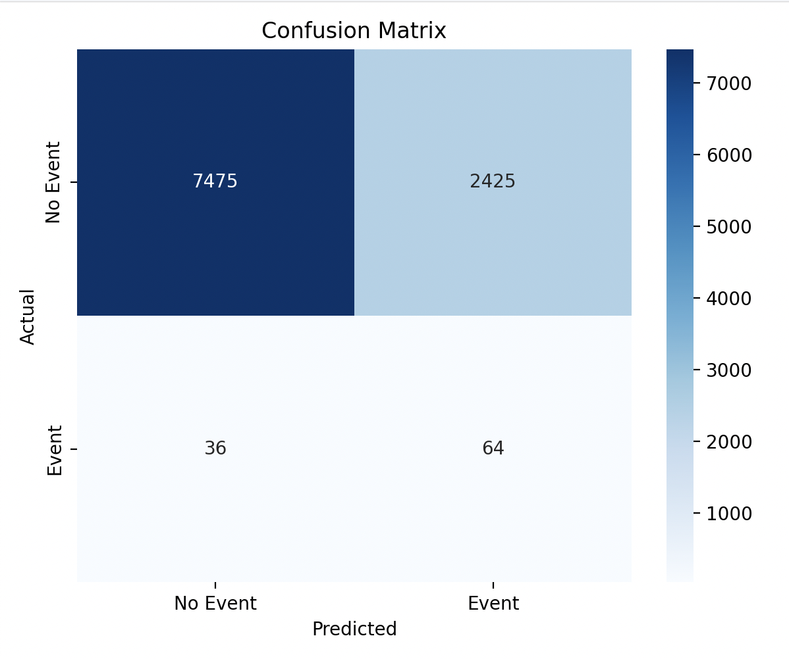

# credit-risk-prediction
## Lasso + SVC
### What is Lasso + SVC?
This model pipeline combines Lasso regression for feature selection with Linear Support Vector Classification (LinearSVC) for prediction. It is designed to handle high-dimensional, imbalanced classification problems efficiently.
Lasso acts as a filter to automatically drop irrelevant features by penalizing their coefficients, shrinking many of them to zero. The reduced feature set is then used by LinearSVC, which is optimized for speed and scalability on large datasets. By combining the two, we achieve both interpretability and efficient computation — critical for real-world applications like credit risk scoring.

### Core Components
Feature Selection with Lasso: Lasso (L1 regularization) shrinks less important feature coefficients to zero, effectively selecting a sparse subset of predictors. 

Classifier: LinearSVC: A fast linear support vector machine optimized for large-scale classification, well-suited for imbalanced data when paired with class weights. 

Undersampling: Reduces the majority class to balance the training distribution. 

Standardization: All features are scaled to zero mean and unit variance to stabilize SVM optimization. 

Evaluation: Model performance is assessed using ROC AUC, Precision-Recall AUC, F1 score, and a confusion matrix. 

### Model Summary
**Lasso Selected Features**: 41  
**Classifier**: LinearSVC(class_weight='balanced', max_iter=1000)  
**LinearSVC ROC AUC**: 0.7810  
**Best F1 Threshold**: 0.4111  
**Accuracy**:  0.7507  
**Precision**: 0.0823  
**Recall**:    0.6651  
**F1 Score**:  0.1465  

### Feature Selection: Lasso

We used Lasso to select the most informative features. It selected 41 features. Below is the bar chart of selected feature coefficients:

### Evaluation: Confusion Matrix

The confusion matrix shows that while false positives are high, the model successfully identifies most default cases (recall ≈ 66.5%).

### Evaluation: ROC Curve

The ROC AUC on the test set is **0.78**, showing solid separability between default and non-default cases.

### Evaluation: Precision-Recall Curve

Precision is low, but recall is high. This is expected due to class imbalance and conservative thresholding.

### Threshold Tuning

F1 score peaks at threshold = **0.4111**, not the default 0.0. This balance improves rare event detection.

---

### Prediction Distribution

Below is the distribution of decision scores for the positive class.

### Conclusion
This modeling pipeline combines Lasso regression for feature selection with a Linear Support Vector Classifier (LinearSVC) to predict credit default events in a highly imbalanced dataset. Lasso selected 41 informative features out of 63, helping reduce noise and improve model generalization. ROC and PR Curves indicate the model performs reasonably well in distinguishing classes, but struggles with precision due to class imbalance. Threshold tuning significantly improves recall while balancing economic cost.Lasso feature coefficients highlight key risk drivers.Prediction distribution shows most decision scores are near the threshold, emphasizing the need for careful cutoff selection.The model effectively identifies rare default events with high recall, crucial in risk-sensitive applications. However, low precision means further strategies (e.g., cost-aware loss functions, ensemble models) may be needed to reduce false positives.

## What Is a Neural Network?

A neural network is a type of machine learning model loosely inspired by the human brain. Just as the brain uses networks of neurons to process signals, artificial neural networks use layers of interconnected units to process data and make decisions.

These networks are built from layers of "neurons" that receive inputs, apply transformations, and pass outputs forward. Each layer refines the information, similar to how sensory signals in the brain are interpreted step by step—from raw sensation to recognition and response.

To guide this learning process, neural networks rely on several core components:

* **Activation functions**, which mimic how biological neurons "fire" only under certain conditions.
* **Loss functions**, which act like feedback signals—telling the network how far off its guesses are.
* **Learning rate**, which controls how quickly the network adjusts itself in response to mistakes, much like how the brain gradually strengthens or weakens connections through experience.

Over time, through repeated exposure and adjustment, the network learns to recognize patterns and make predictions.

## Model Choices Overview

This neural network consists of three layers: two hidden layers (64 and 32 units) with `swish` activation and one output layer with a `sigmoid` function for binary prediction.

* **Activation Function**:

  * Hidden layers use **swish**, defined as:

 $$
 f(x) = x \cdot \sigma(x) = \frac{x}{1 + e^{-x}}
 $$

    Swish is smooth and non-monotonic, offering better gradient flow than ReLU in many cases.

* **Loss Function**:
  A custom **Binary Focal Loss** is applied to emphasize learning from hard examples, with $\gamma = 2.5$ and $\alpha = 0.7$.

* **Learning Rate**:
  The model uses the **Adam** optimizer with an initial learning rate of $10^{-4}$, reduced dynamically when validation F1 stagnates.

## Why These Choices

The main reason behind these design choices is that the dataset is **highly imbalanced**—some types of cases appear far more often than others. If we train a model without adjustments, it will mostly learn to predict the majority class and ignore the rare but important ones.

To address this, we made several choices:

* We used **two hidden layers** to give the model enough capacity to learn patterns, without making it too complex and prone to overfitting.
* We chose the **swish activation function** because it works smoothly and helps the model learn better than traditional functions in some cases.
* We applied **focal loss**, a special loss function that tells the model to focus more on the hard and rare cases rather than the easy ones.
* We set a **small learning rate** to help the model learn gradually and avoid jumping to poor solutions.

In addition to the model design, we also:

* **Balanced the data** using a mix of undersampling and oversampling techniques.
* **Standardized all features** to make training more stable.
* **Used F1 score** to measure performance in a way that better reflects how well the model handles both common and rare cases.

All of these steps work together to help the model stay sensitive to the cases that matter most, even if they’re rare.

## Business Motivation: Cost-Aware Classification

In credit scoring, misclassifying users has different consequences:

* **Rejecting a good user** (false positive) means losing expected profit
* **Approving a bad user** (false negative) risks financial loss

To reflect this, we define two economic indices:

* **Expected Loss Index (ELI)** for bad users:

$$
\text{ELI} = \text{EAD} \times \text{LGD} \times \text{PD}
$$

  where EAD is exposure, LGD is potential loss rate, and PD is default probability.

* **Benefit Index (BI)** for good users:

$$
\text{BI} = \text{Loan Amount} \times \text{Interest Rate}
$$

Using these, we select the prediction threshold that minimizes total expected cost:

$$
\text{Cost} = \text{FP} \times \text{Avg(BI)} + \text{FN} \times \text{Avg(ELI)}
$$

This makes the model sensitive to both business risk and potential gain—not just prediction accuracy.

## Results Summary

The model was trained on highly imbalanced data (**Good: 464,748 vs. Bad: 15,450**), using focal loss and resampling techniques to better detect rare default cases.

### 1. Training Performance

Training stopped at **epoch 48** with automatic learning rate reduction. Final metrics:

* **Training AUC**: 0.8295
* **Training F1**: 0.6769
* **Validation AUC**: 0.8003
* **Validation F1**: 0.1389
* **Validation Loss**: 0.0332

  

---

### 2. Economic Evaluation

We used expected loss (ELI) and benefit (BI) to reflect real-world costs:

| User Type     | Avg. Loss Index (ELI) | Avg. Benefit Index (BI) | Count   |
| ------------- | --------------------- | ----------------------- | ------- |
| Good User (0) | 0.0377                | 0.0262                  | 464,748 |
| Bad User (1)  | 0.0546                | 0.0408                  | 15,450  |

* **Optimal threshold** (economic cost minimized): **0.518**
* **Minimum total cost**: **779.51 (normalized units)**

---

### 3. Classification Metrics at Optimal Threshold

* **Accuracy**: 0.7459
* **Precision**: 0.0279
* **Recall**: 0.7200
* **F1 Score**: 0.0536
* **ROC AUC**: 0.8194
* **PR AUC**: 0.0526

  
  

---

### 4. Threshold and Prediction Distribution

* F1 peaks around threshold = 0.60
* Economic cost is lowest at threshold = 0.518
* Prediction probabilities are mostly concentrated between 0.45 and 0.65

  
  

### 5. Final Note

Although the model has limited precision due to class imbalance, the integration of economic cost analysis helps compensate for this by shifting the decision threshold toward minimizing actual financial loss. This allows the model to remain useful in practice, even when statistical metrics alone appear suboptimal.

